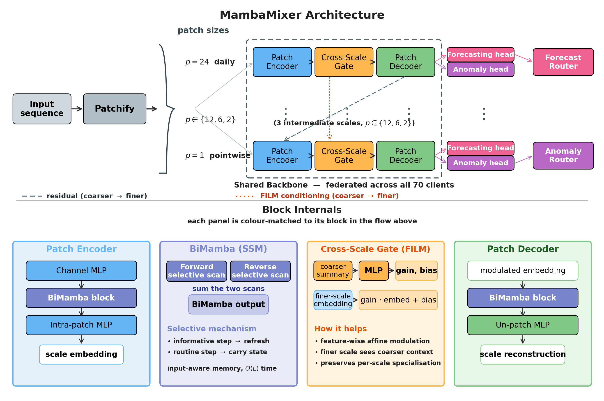
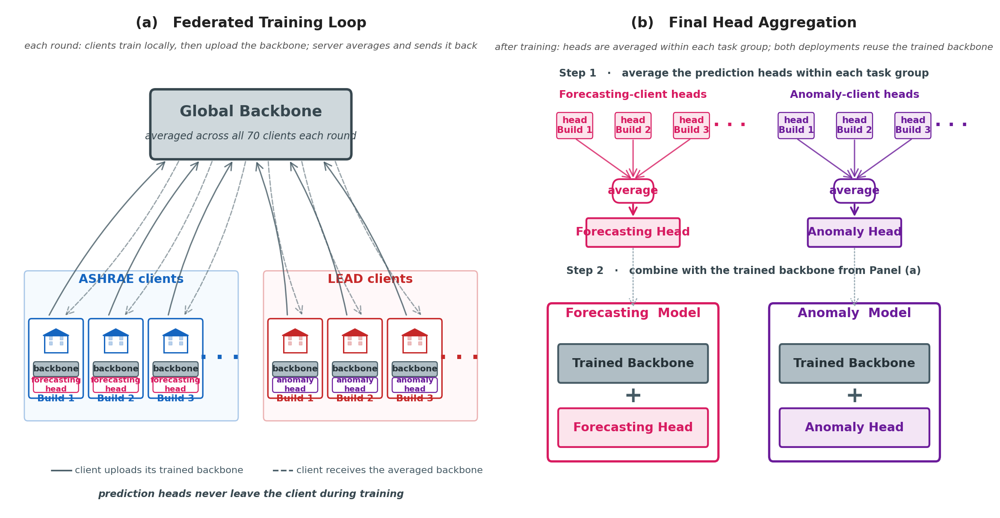

# Cross-Task Federated Backbone Aggregation with Selective State Space Models for Building Energy Analytics

Code and experiment artefacts for our paper accepted at the **BALANCES 2026**
workshop, co-located with ACM Sustainability Week 2026 (Banff, AB, Canada,
June 22–25, 2026).

A single **MambaMixer** (selective SSM) is trained to serve two building-analytics
tasks at once — **hourly load forecasting** (ASHRAE) and **energy anomaly
detection** (LEAD 1.0) — across many buildings without moving raw meter data
off-site. The model splits into a shared **multi-scale BiMamba backbone** and
two small task-specific heads. Each federated round, the backbone is averaged
across *all* clients regardless of task; each head is averaged only within
its task group.

---

## Abstract

Large-scale building management relies on two key analytics capabilities:
*load forecasting* for scheduling and demand response, and *anomaly detection*
for identifying equipment faults and energy inefficiencies. In practice,
meter data is siloed across different owners and regulatory entities, while
edge gateways deploying these models operate under bandwidth constraints.
Federated learning (FL) addresses the privacy concern, yet existing FL
pipelines for building energy train **separate models per task**, duplicating
communication and relearning the same temporal patterns. In parallel, selective
state space models (SSMs) such as Mamba show strong long-range modelling with
linear-time dynamics but remain largely unexplored in federated building-energy
analytics.

We present a unified framework with two complementary components:

1. **MambaMixer** — a multi-scale bidirectional selective-SSM architecture
   tailored for building-energy time series, with a shared backbone plus two
   light task-specific heads (forecasting and anomaly reconstruction).
2. **Cross-Task Federated Backbone Aggregation (CT-FBA)** — an FL protocol
   that aggregates a single SSM backbone across clients drawn from *both*
   tasks, while task heads are aggregated only within their own task group.

We evaluate on 100 real buildings drawn from ASHRAE GEP III and LEAD 1.0,
under FedAvg and FedProx, against single-task FL, local-only training, and
strong centralised baselines (LSTM, LSTM-AE, Informer, MSD-Mixer, ANN-AE).

---

## Architecture



The input window is patchified at five scales `p ∈ {24, 12, 6, 2, 1}`
(daily / half-day / 6-hour / 2-hour / pointwise). Each lane applies a Patch
Encoder, a **BiMamba** selective-SSM mixer (forward + reversed scans), a
**FiLM Cross-Scale Gate** that conditions finer lanes on coarser context,
and a Patch Decoder. The blue–indigo–orange–green blocks form the **shared
backbone** (~830 K parameters); each scale feeds a **forecasting head**
(~55 K) and an **anomaly reconstruction head** (~147 K), each routed by an
AdaptiveScaleRouter that produces a softmax over scales. This backbone /
head split is exactly what the federated protocol exploits — the backbone
is averaged across all 70 clients regardless of task, while the two heads
are averaged only within their task groups.



The figure above shows the **Cross-Task Federated Backbone Aggregation
(CT-FBA)** protocol. Each of the 70 federated clients holds either an
ASHRAE forecasting building or a LEAD anomaly-detection building (never
both). At every round, the shared multi-scale BiMamba backbone is averaged
across **all 70 clients regardless of task**, while the forecasting head
and the anomaly reconstruction head are averaged only within their own
task groups (35 clients each). This is what lets a single SSM backbone
learn jointly from both tasks without either client pool ever exposing
its raw meter data or its task-specific head weights to the other.

---

## Novelty / unique features

- **Cross-task backbone sharing in FL.** Unlike prior building-energy FL
  pipelines that train a separate model per task, we aggregate **one** SSM
  backbone across heterogeneous clients drawn from both tasks. Forecasting
  clients supply dense, clean-signal supervision (per-window MSE on hourly
  load) that the anomaly reconstruction head implicitly inherits, even
  though no client carries labels for both tasks.
- **Selective SSM core for energy signals.** Bidirectional Mamba with
  input-dependent step size Δₜ lets the latent state refresh on informative
  timesteps (occupancy transitions, demand spikes) and carry forward through
  uninformative ones — a strong inductive bias for bursty meter data, in
  *O(L)* time.
- **Multi-scale residual decomposition + FiLM gating.** Five patch sizes
  process daily / half-day / 6-hour / 2-hour / pointwise bands; each lane
  removes its reconstructed component from the residual, and FiLM
  modulation lets coarse lanes condition fine ones.
- **Communication-efficient deployment topology.** A naive dual-task
  federation uploads two full backbones per round (~6.64 MB). Our split
  uploads one backbone plus a single task head (~3.54–3.91 MB), a
  **41–47 % per-round reduction**.
- **Reproducible, leakage-free evaluation.** 50 ASHRAE + 50 LEAD buildings
  with disjoint client pools (no building appears in both tasks), 70 federated
  training clients + 30 unseen-building test clients, fully deterministic
  preprocessing under seed 42.

---

## Summary of results

Evaluated on **100 buildings** (15 unseen-building test clients per task),
metrics averaged across the unseen-building test clients.

| Method | Setting | Forecasting R² ↑ | Forecasting MAPE (%) ↓ | Anomaly F1 ↑ | Anomaly AUC-ROC ↑ | Anomaly Precision ↑ |
|---|---|---|---|---|---|---|
| Local-Only | Local | 0.925 | 24.8 | 0.488 | 0.761 | 0.641 |
| Single-Task FL | FL-35 | **0.942** | 29.0 | 0.518 | 0.801 | 0.862 |
| **Cross-Task FL, FedAvg** *(ours)* | FL-70 | 0.937 | **22.1** | 0.526 | **0.804** | **0.992** |
| **Cross-Task FL, FedProx** *(ours)* | FL-70 | 0.939 | 27.7 | **0.539** | 0.791 | 0.988 |
| MambaMixer (centralised, non-private) | Central | *0.946* | *28.3* | *0.551* | *0.838* | *0.945* |

Headline takeaways:

- **+13 percentage-point anomaly precision** vs. single-task FL (0.992
  vs. 0.862) and the best AUC-ROC of any federated method.
- **Best forecasting MAPE overall (22.1 %)** — below every other condition,
  including the centralised MambaMixer (28.3 %).
- **Within 1 % of centralised R² and 3.4 points of centralised AUC-ROC**,
  without ever moving raw meter data off-site.
- **41–47 % less per-round communication** than a naive dual-task federation.
- Beats centralised LSTM on forecasting (0.937 vs. 0.934) and centralised
  LSTM-AE on anomaly AUC-ROC (0.804 vs. 0.796).

See the paper for full per-metric tables, convergence plots, and threshold-
sensitivity analysis.

---

## 1. Repository layout

```
cross-task-fl/
├── main.py                       # top-level entry (FL + centralized + baselines + plots)
├── preprocess.py                 # build 50/50 building splits with 70/20/10 temporal slices
├── requirements.txt              # pinned Python dependencies (see §2)
├── .gitattributes                # Git LFS rules for the dataset CSVs + checkpoints
├── configs/
│   └── config.py                 # ExperimentConfig dataclass — every knob lives here
├── models/
│   ├── mamba_mixer.py            # MambaMixer: multi-scale patching, BiMamba SSM, FiLM gate, heads
│   └── baselines/                # LSTM, LSTM-AE, ANN-AE, Informer, MSD-Mixer
├── trainers/
│   ├── multitask_fed_trainer.py  # cross-task FL (FedAvg / FedProx) + dual/single_task/local_only
│   └── centralized_trainer.py    # pooled-data upper bound + per-baseline training
├── data_provider/
│   ├── ashrae_dataset.py         # get_ashrae_fl_data, get_ashrae_centralized_loaders
│   └── lead_dataset.py           # get_lead_fl_data, get_lead_centralized_loaders
├── experiments/
│   └── run_baselines.py          # centralized baselines on identical splits
├── utils/                        # metrics + logging helpers
├── visualization/                # research-paper plots from saved JSON results
├── figures/                      # MambaMixer architecture + cross-task FL aggregation diagrams
├── data/                         # processed CSVs + split_metadata.json  (tracked via Git LFS)
│   ├── ashrae/processed/         #   ashrae_clean.csv, split_metadata.json
│   └── lead/processed/           #   lead_clean.csv,   split_metadata.json
├── checkpoints/                  # trained .pt weights (tracked via Git LFS — see §3)
├── raw/                          # raw ASHRAE / LEAD CSVs                ← only needed if you re-run preprocess.py
├── results/                      # (created at run time) JSON metrics, CSVs, figures
└── logs/                         # (created at run time) text + CSV training logs
```

Both the `data/` directory and the pre-trained `checkpoints/` ship **inside
the repository** via Git LFS — no manual downloads are required to
reproduce or evaluate. See §3 for the exact files and how to fetch them.

---

## 2. Environment

- Python **3.10+** (tested on 3.10–3.12)
- CUDA-capable GPU recommended (any single GPU is sufficient; multi-GPU is
  optional, see `max_federated_gpus`).
- [Git LFS](https://git-lfs.com/) — required at clone time to fetch the
  dataset CSVs under `data/.../processed/` and the pre-trained checkpoints
  under `checkpoints/` (see §3).

### One-time setup

```bash
# 1. Install Git LFS (one-time per machine), then clone the repo. The
#    initial clone will fetch the dataset CSVs and trained checkpoints.
#    See https://git-lfs.com/ for platform-specific installers.
git lfs install
git clone <repo-url> cross-task-fl
cd cross-task-fl
# If the repo was already cloned without LFS, fetch the LFS files now:
git lfs pull

# 2. Create an isolated environment and install the pinned dependencies.
python -m venv .venv
source .venv/bin/activate              # Windows: .venv\Scripts\activate
pip install --upgrade pip
pip install -r requirements.txt

# 3. (Optional, CUDA only) Install the official selective-scan kernels for
#    a ~1.5–2× speed-up. They are commented out in requirements.txt because
#    they only build against a matching CUDA toolchain — the model falls
#    back to a pure-PyTorch BiMamba implementation when they are missing,
#    so numerical results are unaffected.
pip install mamba-ssm causal-conv1d
```

If your CUDA driver is not the default the pip `torch` wheel targets, follow
the matrix at <https://pytorch.org/get-started/> to install a matching
build *before* `pip install -r requirements.txt`.

### Sanity check

```bash
python -c "import torch, einops, pandas, sklearn, matplotlib, seaborn, tqdm; \
print('torch', torch.__version__, 'cuda', torch.cuda.is_available())"
```

---

## 3. Getting the data and checkpoints

### Data — committed to the repository (Git LFS)

The processed CSVs and split metadata used in every experiment in the paper
live in this repository under [data/](data/) and are tracked via Git LFS.
A normal `git clone` (with `git lfs install` having been run once on your
machine) fetches them automatically; on an existing clone use `git lfs pull`.

The final layout is:

```
data/
├── ashrae/processed/
│   ├── ashrae_clean.csv          # tracked via Git LFS
│   └── split_metadata.json
└── lead/processed/
    ├── lead_clean.csv            # tracked via Git LFS
    └── split_metadata.json
```

With these files present you can **skip `python preprocess.py`** and go
straight to §4.

### Checkpoints — committed to the repository (Git LFS)

The trained `.pt` weights for every condition reported in the paper are
also tracked under [checkpoints/](checkpoints/) via Git LFS. The same
`git clone` (with `git lfs install` run beforehand) fetches them
automatically; on an existing clone use `git lfs pull`. With these present
you can evaluate the saved models directly (see §4) without re-running
training.

The committed checkpoints are:

```
checkpoints/
├── centralized_forecasting_model.pt
├── centralized_anomaly_model.pt
├── fed_forecasting_model.pt                       # Cross-Task FL, FedAvg (proposed) — forecasting head
├── fed_anomaly_model.pt                           # Cross-Task FL, FedAvg (proposed) — anomaly head
├── fed_dual_fedprox_forecasting_model.pt
├── fed_dual_fedprox_anomaly_model.pt
├── fed_single_task_fedavg_forecasting_model.pt
├── fed_single_task_fedavg_anomaly_model.pt
├── fed_local_only_fedavg_forecasting_model.pt
└── fed_local_only_fedavg_anomaly_model.pt
```

Note that the proposed cross-task FedAvg checkpoints are stored with the
shorter `fed_forecasting_model.pt` / `fed_anomaly_model.pt` names (the
naming used when these particular weights were saved). The current
`main.py` writes the more explicit `fed_{mode}_{strategy}_*.pt` form
(e.g. `fed_dual_fedavg_forecasting_model.pt`) when you re-train, which
will overwrite or sit alongside the committed files. Re-running any
command in §4 (re-)populates this directory from scratch.

### (Optional) Rebuild the processed CSVs from raw

The committed `data/.../processed/*.csv` files are deterministic outputs of
[preprocess.py](preprocess.py). You only need to re-run them if you change
the building-selection or split logic in [configs/config.py](configs/config.py).
To do so, fetch the raw datasets:

| Dataset | Task | Source | Notes |
|---|---|---|---|
| **ASHRAE Great Energy Predictor III** | hourly load forecasting | Kaggle: `ashrae-energy-prediction` (`train.csv`) | electricity meters only (`meter == 0`) |
| **LEAD 1.0** | energy anomaly detection | Kaggle: `lead1-0-an-large-scale-energy-anomaly-detection` (`train.csv`) | expert-labelled anomalies on ASHRAE electricity series |

Point the preprocessor at them with environment variables, then run it:

```bash
export ASHRAE_RAW_CSV=/path/to/ashrae_train.csv
export LEAD_RAW_CSV=/path/to/lead_train.csv
python preprocess.py
```

Or place the files at the default locations `raw/train_ashrae.csv` and
`raw/train_lead.csv`. The preprocessor overwrites the committed
`data/.../processed/` files in place.

Expected raw schema (enforced by [preprocess.py](preprocess.py)):
- ASHRAE: `building_id, timestamp, meter, meter_reading`
- LEAD:   `building_id, timestamp, meter_reading, anomaly`

The whole pipeline is deterministic — building selection, train/test split,
and torch RNG are all seeded by `seed = 42` in
[configs/config.py](configs/config.py), so a fresh rebuild reproduces the
committed CSVs byte-for-byte on matching Python/NumPy versions.

---

## 4. Reproducing the headline results

Assuming `data/` is populated (i.e. the LFS pull in §3 completed, or you
re-ran `python preprocess.py`).

```bash
# Proposed: cross-task FL with FedAvg (dual aggregation across all 70 clients)
#   Also runs the centralised upper bound + visualisation in one go.
python main.py

# Cross-task FL with FedProx (mu = 0.01, set in config)
python main.py --federated --strategy fedprox

# Ablations
python main.py --federated --mode single_task   # average within each task only
python main.py --federated --mode local_only    # no parameter exchange

# Centralised upper bound only (pooled data)
python main.py --centralized

# SOTA baselines on identical splits: LSTM, Informer, MSD-Mixer, LSTM-AE, ANN-AE
python main.py --baselines
#   or directly, with finer control:
python -m experiments.run_baselines
python -m experiments.run_baselines --task forecasting --model informer

# Regenerate figures from whatever JSON files are already in results/
python main.py --visualize
```

### One-shot full reproduction

```bash
# The first line is only needed if you want to regenerate the processed CSVs
# from raw (see §3). Otherwise the LFS-committed data/ is ready to use.
python preprocess.py

python main.py                                    # proposed + centralized + plots
python main.py --federated --strategy fedprox     # FedProx variant
python main.py --federated --mode single_task     # ablation
python main.py --federated --mode local_only      # ablation
python main.py --baselines                        # SOTA baselines
python main.py --visualize                        # consolidate all plots
```

End-to-end on a single modern GPU (RTX 3090 / A100) is on the order of
hours, dominated by the centralised baselines.

### Evaluating from the downloaded checkpoints (no training)

`main.py` does not yet expose a dedicated `--evaluate-only` flag, but the
saved `.pt` files in `checkpoints/` are plain `state_dict`s for the
MambaMixer architecture built by `build_forecasting_model` / `build_anomaly_model`
in [main.py](main.py). A minimal evaluation snippet looks like:

```python
import torch
from configs.config import ExperimentConfig
from main import build_forecasting_model, build_anomaly_model
from data_provider.ashrae_dataset import get_ashrae_centralized_loaders
from data_provider.lead_dataset  import get_lead_centralized_loaders
from utils.metrics import compute_forecasting_metrics, compute_anomaly_metrics, find_threshold_on_validation

cfg = ExperimentConfig()
device = torch.device("cuda" if torch.cuda.is_available() else "cpu")

fc = build_forecasting_model(cfg).to(device).eval()
fc.load_state_dict(torch.load("checkpoints/fed_forecasting_model.pt", map_location=device))
# … then iterate the test loader from get_ashrae_centralized_loaders() and call compute_forecasting_metrics
```

The anomaly model uses `build_anomaly_model` and
`get_lead_centralized_loaders`; pick the threshold on the validation loader
with `find_threshold_on_validation` before computing test metrics, exactly
as [main.py:200-209](main.py#L200-L209) does.

---

## 5. Key configuration knobs

All knobs live in [configs/config.py](configs/config.py); the CLI flags
in `main.py` only override `aggregation_mode` and `fl_strategy`. To change
any other value, edit the dataclass.

| Knob | Default | Meaning |
|---|---|---|
| `seed` | 42 | controls building selection, splits, and torch RNG |
| `seq_len` / `pred_len` | 128 / 24 | input window and forecasting horizon (hours) |
| `patch_sizes` | (24,12,6,2,1) | multi-scale patch sizes consumed by the BiMamba backbone |
| `hid_chn`, `hid_pch`, `hid_pred`, `d_ssm`, `state_size`, `expand`, `conv_kernel` | see file | MambaMixer dims |
| `num_rounds` / `local_epochs` | 10 / 5 | FL schedule |
| `client_lr`, `weight_decay`, `grad_clip` | 1e-3, 0.01, 1.0 | client AdamW + clipping |
| `participation_rate` | 1.0 | 100% participation (all 70 clients per round) |
| `aggregation_mode` | `dual` | `dual` (proposed), `single_task`, `local_only` |
| `fl_strategy` | `fedavg` | `fedavg`, `fedprox` (`fedprox_mu = 0.01`) |
| `mask_rate` | 0.25 | reconstruction mask rate for the anomaly head |
| `clean_only` | True | train autoencoders on clean windows only |
| `lambda_mse`, `lambda_acf`, `acf_cutoff` | 0.1, 0.3, 2 | residual auxiliary loss weights |
| `centralized_max_epochs` / `centralized_early_stop` | 100 / 15 | centralised training schedule |
| `batch_size` / `num_workers` | 32 / 0 | DataLoader |
| `max_federated_gpus` | 1 | bump to 2 to train the two task groups in parallel |

---

## 6. Outputs

After a full run:

```
results/
├── federated_dual_fedavg_results.json        # proposed
├── federated_dual_fedprox_results.json       # FedProx
├── federated_single_task_fedavg_results.json # ablation
├── federated_local_only_fedavg_results.json  # ablation
├── centralized_results.json                  # pooled-data upper bound
├── baseline_results.json                     # LSTM / Informer / MSD-Mixer / LSTM-AE / ANN-AE
├── comparison.json                           # fed vs centralised side-by-side
└── figures/                                  # paper plots
checkpoints/   # .pt state_dicts for every trained model
logs/          # text logs + per-round/per-epoch CSV
```

Each `*_results.json` contains the full config snapshot, model parameter
counts (total / shared backbone / per-head), the round-by-round history,
and the final metrics:

- **Forecasting**: `mse`, `rmse`, `mae`, `mape`, `r2`
- **Anomaly**: `f1`, `auc_roc`, `auc_pr`, `precision`, `recall`, plus the
  validation-selected threshold

All numbers reported in the paper come from these JSONs.

---

## 7. Troubleshooting

- **`FileNotFoundError: .../split_metadata.json`** — `data/` was not
  populated. The most common cause is that `git lfs install` was not run
  before the clone, so the CSVs are still LFS pointers. Run `git lfs install`
  followed by `git lfs pull` in the repo root, or regenerate the files with
  `python preprocess.py` after setting the raw-CSV env vars (see §3).
- **`*.csv` or `*.pt` files look ~130 bytes and start with
  `version https://git-lfs...`** — LFS pointers were checked out instead of
  the real files. Same fix as above: `git lfs install && git lfs pull`.
- **`ModuleNotFoundError: mamba_ssm`** — safe to ignore; the pure-PyTorch
  BiMamba path is used automatically.
- **CUDA OOM** — lower `batch_size` in [configs/config.py](configs/config.py),
  or set `max_federated_gpus = 1` to disable threaded multi-GPU training.
- **Checkpoint shape mismatch when loading** — make sure the
  `ExperimentConfig` values for `seq_len`, `pred_len`, `patch_sizes`, and
  the MambaMixer hidden-dim fields are unchanged from defaults; the
  released checkpoints were trained with the defaults in
  [configs/config.py](configs/config.py).

---

## 8. License & citation

Released under the repository's [LICENSE](LICENSE). If you use this code or
build on this work, please cite our paper:

```bibtex
@inproceedings{kumar2026crosstask,
  title     = {Cross-Task Federated Backbone Aggregation with Selective State
               Space Models for Building Energy Analytics},
  author    = {Kumar, Bhanu and Srivastava, Naman and Arjunan, Pandarasamy},
  booktitle = {ACM Sustainability Week 2026 (ACM Sustainability Week Companion '26),
               June 22--25, 2026, Banff, AB, Canada},
  year      = {2026},
  publisher = {Association for Computing Machinery},
  address   = {New York, NY, USA},
  doi       = {10.1145/3765611.3815362},
  isbn      = {979-8-4007-2199-1/2026/06}
}
```

A plain-text fallback:

> Bhanu Kumar, Naman Srivastava, and Pandarasamy Arjunan. 2026. *Cross-Task
> Federated Backbone Aggregation with Selective State Space Models for
> Building Energy Analytics.* In ACM Sustainability Week 2026 (ACM
> Sustainability Week Companion '26), June 22–25, 2026, Banff, AB, Canada.

---

## 9. Acknowledgements

This work would not have been possible without the following data and tools:

**Datasets**

- **ASHRAE — Great Energy Predictor III** (Kaggle). Hourly meter readings
  from 1,448 buildings, released by ASHRAE for the GEPIII competition. We
  use the electricity meter subset as the forecasting task source.
  Miller et al., *The ASHRAE Great Energy Predictor III competition*
  (2020).
- **LEAD 1.0** (Kaggle). Large-scale expert-annotated energy anomaly
  detection dataset derived from ASHRAE GEP III electricity meters.
  Gulati and Arjunan, *LEAD 1.0: A large-scale annotated dataset for
  energy anomaly detection in commercial buildings* (2022).

We thank the dataset authors and Kaggle for hosting these benchmarks; all
experimental results in this repository are derived from these publicly
available sources.

**Software and tools**

- [PyTorch](https://pytorch.org/) — model implementation and training.
- [mamba-ssm](https://github.com/state-spaces/mamba) and
  [causal-conv1d](https://github.com/Dao-AILab/causal-conv1d) — official
  selective-scan CUDA kernels (used when available; a pure-PyTorch fallback
  is included).
- [NumPy](https://numpy.org/), [pandas](https://pandas.pydata.org/),
  [scikit-learn](https://scikit-learn.org/) — preprocessing and metrics.
- [Matplotlib](https://matplotlib.org/) and
  [Seaborn](https://seaborn.pydata.org/) — figures and visualisations.
- [tqdm](https://github.com/tqdm/tqdm) — progress reporting.

**Affiliation and support**

This research was conducted at the **Indian Institute of Science (IISc),
Bengaluru**, jointly between the *Department of Mathematics and Computing*
and the *Robert Bosch Centre for Cyber-Physical Systems (RBCCPS)*.

We also acknowledge the broader open-source community whose work on
state-space models (S4, Mamba, Vision Mamba), federated optimisation
(FedAvg, FedProx), and time-series mixing architectures (Informer,
MSD-Mixer) made the baselines and architectural building blocks in this
project possible — full citations are in the paper.
